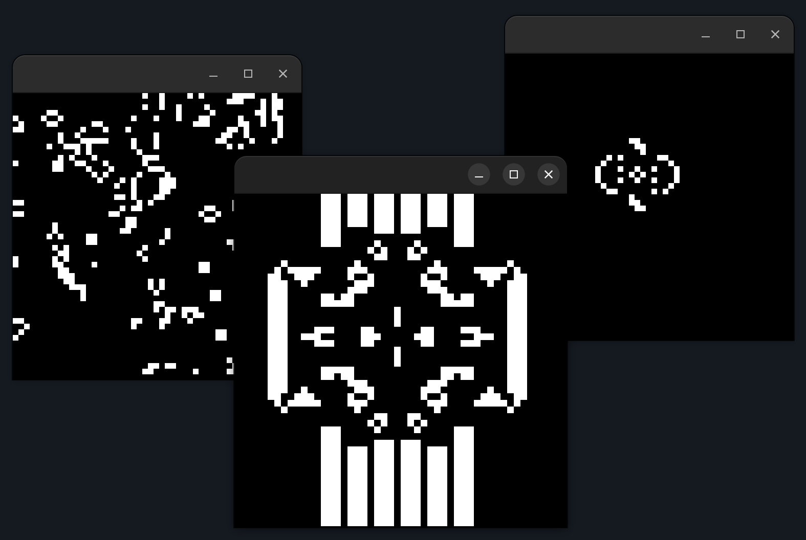

# Conway's Game of Life
implementation of Conway's game of life in OpenFrameworks
## Usage
Add sourcefiles to a fresh Openframeworks app and build it.
Change SIZE macro to change board size.
The board wraps around.
Press 'space' to halt/continue the progression of the game.
Press 'r' to draw random noise over the entire board.
Press 'b' to set all the cells to dead.

Left click/drag with the cursor on the bord to make cells alive,
right click/drag to make them dead.
